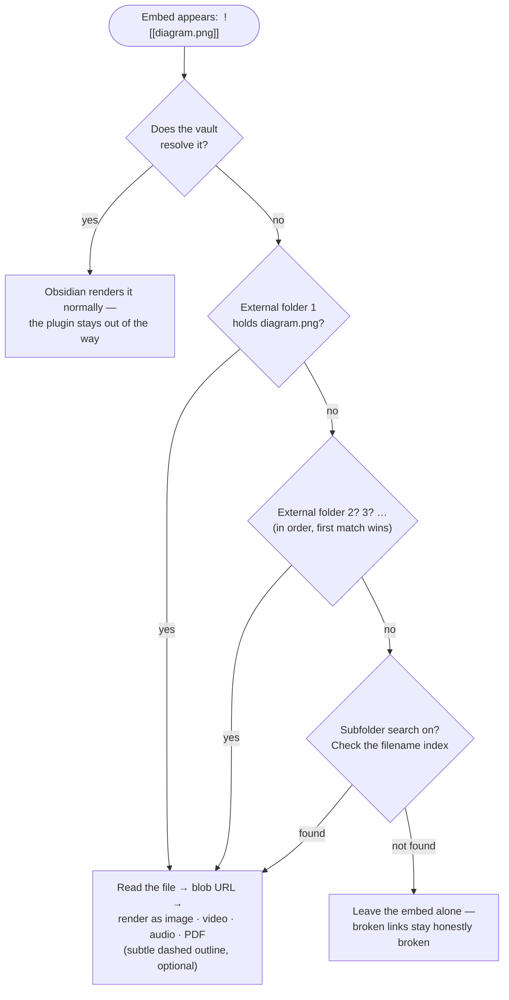
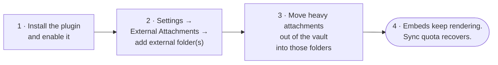

# External Attachments

> *"The map is not the territory."* — Alfred Korzybski

An [Obsidian](https://obsidian.md) plugin for vaults that outgrow their cloud storage. When an attachment embed fails to resolve inside the vault, the plugin quietly searches one or more folders **outside** the vault — an external drive, a second free cloud account, a NAS share — and renders the file from there. Your wikilinks keep working. Your sync quota breathes again.

## Why this exists

A wikilink works like a map; the file lives in some territory. Obsidian assumes the territory sits inside the vault, and that assumption holds up beautifully — right until the vault syncs through a free cloud tier and the scans, videos, and voice memos blow past the quota.

At that point the standard advice forks in two directions: delete your history, or pay rent on it forever. Both answers treat the vault's folder boundary as a law of nature rather than a default setting. This plugin opens a third door. Move the heavy files anywhere you like — spread them across as many free accounts, drives, and shares as you care to maintain — and the embeds keep resolving as if nothing moved. The note never learns the difference.

Nothing else did this, so this had to exist. Now it does, and you can have it for free.

## How resolution works

The plugin practices strict non-interference: if Obsidian can resolve an embed, the plugin does nothing at all. Only genuinely broken embeds get a second chance.



Matching happens by **filename**, so `![[diagram.png]]` finds `diagram.png` wherever it landed. Width and height suffixes like `![[diagram.png|400]]` and `![[diagram.png|400x300]]` still apply, and unknown file types fall back to a download link.

## Setup



1. **Install** (see below) and enable the plugin.
2. **Add folders** in Settings → External Attachments. Each entry takes an absolute path — `D:\ObsidianAttachments`, a Google Drive mirror, a Dropbox folder, anything your OS mounts as a directory. Order matters: the plugin checks folders top to bottom and stops at the first match. A status line under each path tells you whether the plugin can reach it.
3. **Move files.** Cut attachments from the vault and paste them into an external folder. Don't rename them — the filename serves as the whole address.
4. **Verify.** Open a note that embeds a moved file. It should render with a faint dashed outline (your reminder that this file now lives off-vault; you can switch the outline off).

To split attachments across several free cloud services, install each service's desktop sync client, give each one a folder, and list all of those folders in settings. The plugin treats them as one big pool.

## Settings

- **External folders** — an ordered list of absolute paths; add and remove freely. Earlier folders win when two hold the same filename.
- **Search subfolders** — off by default. When on, the plugin also indexes every subfolder of each external folder (filename → path, built lazily on first use).
- **Show visual indicator** — the dashed outline around externally-resolved embeds. On by default; purely cosmetic.

## Commands

- **Rescan current view** — re-render the active note. Useful right after you move a file externally.
- **Rebuild external folder index** — clear the subfolder index so the next lookup rebuilds it. Run this after adding many files to nested folders.

## Rules of the game

Every tool encodes assumptions; these deserve stating plainly rather than discovering painfully.

- **Desktop only.** The plugin reads the local filesystem, which mobile Obsidian doesn't expose.
- **Filenames act as addresses.** Keep them unique across your external folders. With duplicates, the first folder in your list wins — deterministic, but worth knowing.
- **Read-only rendering.** External files render into your notes but never rejoin the vault. Obsidian's own features (renaming, outgoing-link counts, canvas drag-in) don't see them.
- **Misses get cached per view.** If an embed resolves nowhere, the plugin marks it and moves on rather than hammering the disk on every keystroke. After you add the missing file, run the rescan command or reopen the note.
- **Privacy.** The plugin reads only the folders you list, makes zero network requests, and phones home to nobody. Your settings live in the plugin's own `data.json` and travel with whatever syncs your vault.

## Installing

Until the plugin lands in the community catalog, install with [BRAT](https://github.com/TfTHacker/obsidian42-brat) pointed at this repo, or copy `main.js`, `manifest.json`, and `styles.css` from a [release](https://github.com/DyllonWright/Obsidian-External-Attachments/releases) into `<vault>/.obsidian/plugins/external-attachments/`.

Upgrading from a pre-release single-folder build? Your existing `data.json` migrates automatically — the old mount path becomes the first entry in the folder list.

## Developing

```bash
npm install
npm run dev     # esbuild watch mode
npm run build   # typecheck + production bundle
npm test        # resolver test suite — keep it green
```

The resolver (`src/resolver.ts`) contains all the filesystem logic and imports nothing from Obsidian, so the test suite exercises it directly against real temporary directories. The plugin shell (`src/main.ts`) handles the DOM side: markdown post-processing for reading view, a `MutationObserver` for live preview, and blob-URL lifecycle management so memory gets released when embeds leave the screen.

One stylistic note for contributors: the README and UI text keep to [E-Prime](https://en.wikipedia.org/wiki/E-Prime) — English without any form of "to be" — as a small tribute to Korzybski and Robert Anton Wilson, who argued that dropping "is" makes claims about *what happened* easier to tell apart from claims about *what things really are*. A plugin whose entire job involves the gap between a link and a file might as well practice what it renders.

## License

MIT
